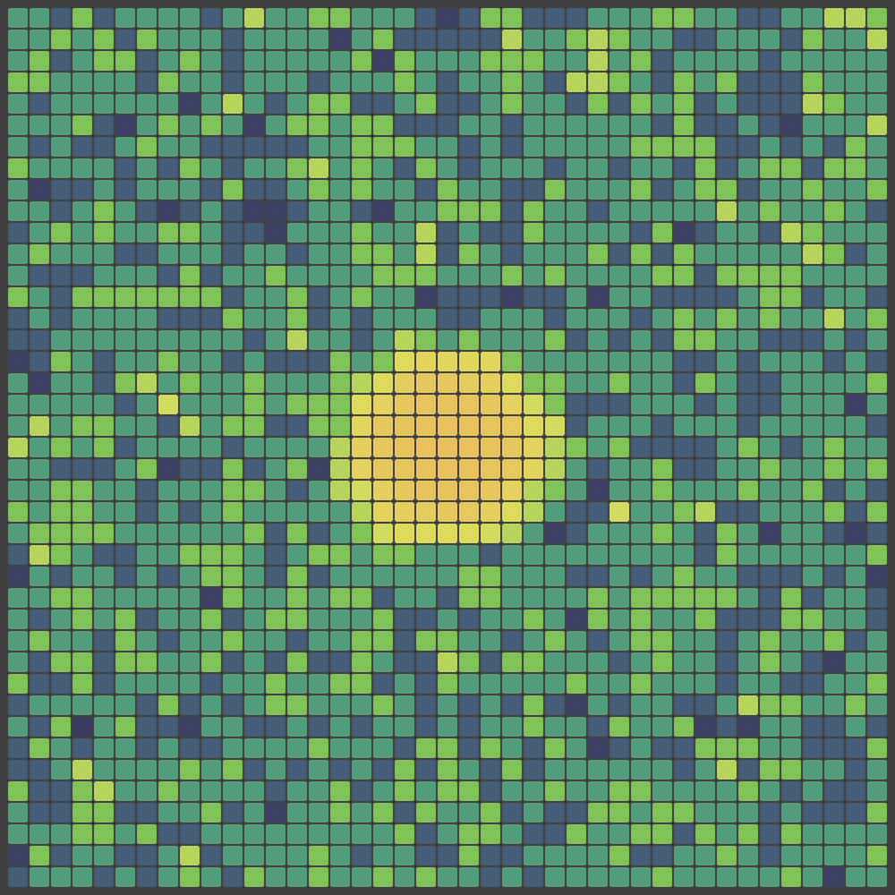
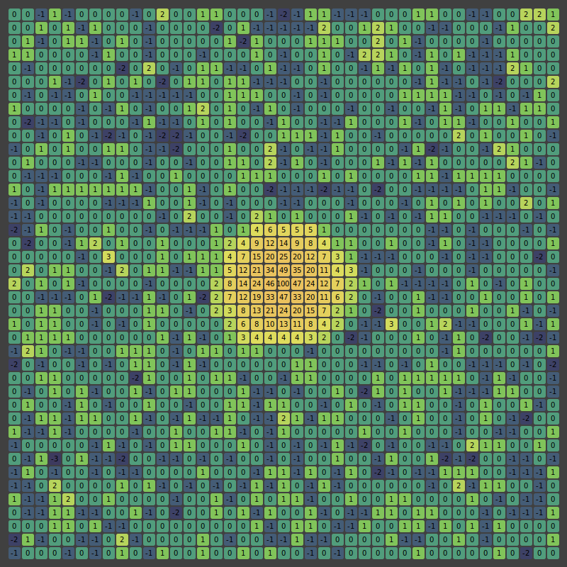

## Simulations for the Discrete Gaussian Model

The code here outputs (very-near) perfect samples from the Discrete Gaussian model using a (cutoff) version of the Coupling from the Past method. The following picture is an output from the program,
under the additional constraint of a large deviation at a site. This exhibits the so-called harmonic pinnacle phenomenon.

Here is the same image with the heights indicated.

